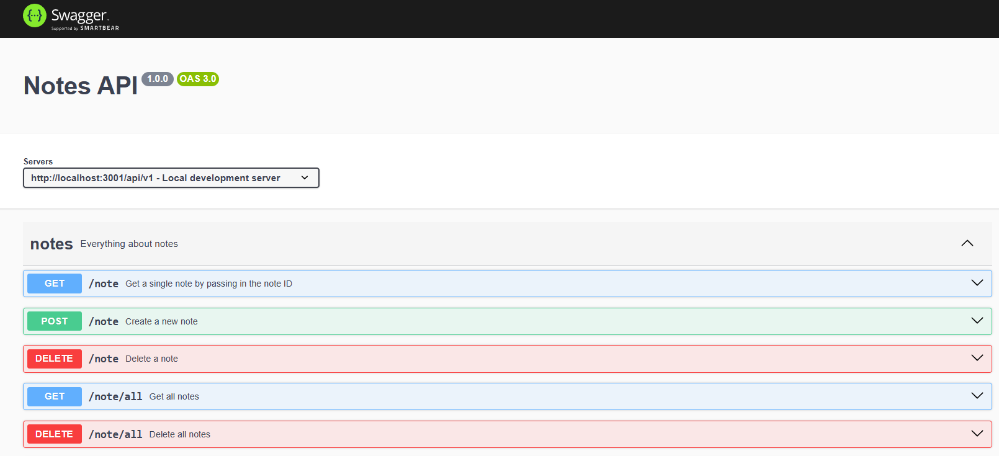

# ToDoodle
For now the most basic To Do App we can possibly do.


# Project Overview


A simple, intuitive todo application to help users organize and track their daily tasks efficiently.  

## WIP demo  


Download the full demo here, [WIP_demo](./docs/assets/WIP_demo.mp4).

## Development plan

### Features planned
- [x]  User can create a new note.
- [x]  User can edit their notes.
- [x]  User can delete their notes.
- [x]  User can save notes.
- [x]  User can type text input to their notes.
- [x]  User can create a user account.
- [x]  User can log into their user account.
- [x]  User can log out of their account.
- [x]  User can access the website via a url link.
- [ ]  User can upload profile pictures.
- [ ]  User can edit their profile names, email and password.
- [ ]  Debouncing and throttling.
- [ ]  Google oauth.
- [ ]  2FA authentication.

### DevOps
- [ ] Dockerise dev.
- [ ] Add unit testing for backend.
- [x] Add OpenAPI specification for backend (Swagger UI).
- [ ] Add GitHub Actions CI/CD.
- [ ] Implement proper GitHub flow once CI/CD and deployment to prod is up.
- [ ] Deploy to AWS cloud. Monolithic EC2 for now.

## Getting started

### Installation

Git clone the repository
```sh
git clone https://github.com/jeremyu25/ToDoodle/
```
Navigate to frontend folder and install npm packages for the frontend.
```sh
cd todoodlefrontend
npm install
```

Navigate to the backend folder and install npm packages for the backend.
```sh
cd backend
npm install
```

(TBD: Upload initial setup SQL script and Supabase instructions.)

### Running in development

We need to run the frontend and backend separately.

To run the frontend
```sh
cd todoodlefrontend
```
Run this command to start the frontend server
```sh
npm run dev
```

To run the backend
```sh
cd backend
```

Run this command to start the backend server
```sh
npm run dev
```

Remember to start up your local postgres / cloud database as per your configuration.

## Configurations used

Add a .env file in the frontend and backend folder respectively.
(TBD: Add keys like DATABASE_URL, PORT, JWT_SECRET, etc.)

## Running SwaggerUI

When running backend server, open another url for the openapi documentation: http://localhost:3001/api-docs/.



## Tech stack

ReactJS Typescript - frontend  
ExpressJS NodeJS - backend  
Postgresql (Supabase) - database  
Vite - build tool  

## License

This project is licensed under the MIT License - see the [LICENSE.md](LICENSE.md) file for details.
